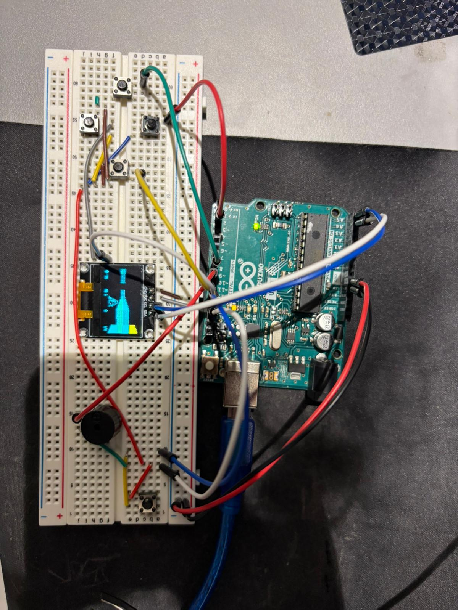

# Will It Run Doom? — Breadboard Edition

A working Doom-inspired 3D raycasting game running on an Arduino Nano, wired up on a breadboard with a tiny OLED display and four buttons. Yes, it runs.

## Demo

See it in action: [doom-breadboard-showcase.mp4](doom-breadboard-showcase.mp4)

## What It Is

This is not a full Doom port — it's a 3D raycasting engine (Wolfenstein 3D style) using Doom sprites, running entirely on an ATmega328P microcontroller. The chip has only 32KB of program memory and 2KB of RAM, with 1KB of that reserved for the screen buffer.

Features:
- 3D raycast rendering at up to ~15 FPS
- Depth-based dithering for distance effects
- Enemy AI with melee and fireball attacks
- Item collection and wall collision
- Jogging effect
- HUD with custom font rendering
- Optional buzzer sound support

## Hardware

| Component | Details |
|---|---|
| Microcontroller | Arduino Uno or Nano (ATmega328P) |
| Display | SSD1306 OLED 128x64 (I2C) |
| Buttons | 4x tactile buttons (uses internal pull-up resistors) |
| Buzzer | Optional, connected to Pin 9 |
| Protoboard | Standard breadboard |

## Wiring

| Button | Pin |
|---|---|
| Left | 8 |
| Right | 11 |
| Up | 2 |
| Down | 12 |
| Fire | 13 |

Sound pin: 9 (tied to hardware timer, do not change)

Display is connected via I2C (SDA/SCL).

## Software

The sketch is in [Doom/Doom.ino](Doom/Doom.ino). Open it in the Arduino IDE, select your board (Uno or Nano, ATmega328P), and upload.

Key settings in [Doom/constants.h](Doom/constants.h):
- `FRAME_TIME` — target ms per frame (default ~15 FPS)
- `RES_DIVIDER` — trade horizontal resolution for performance
- `Z_RES_DIVIDER` — Z-buffer resolution (affects sprite depth accuracy)

## Credits

- Sprites from [The Spriters Resource](https://www.spriters-resource.com)
- Raycasting technique from [Lode's Computer Graphics Tutorial](https://lodev.org/cgtutor)
- SSD1306 optimizations and sound support by [@miracoly](https://github.com/miracoly)
- Original doom-nano project by [daveruiz](https://github.com/daveruiz/doom-nano)
